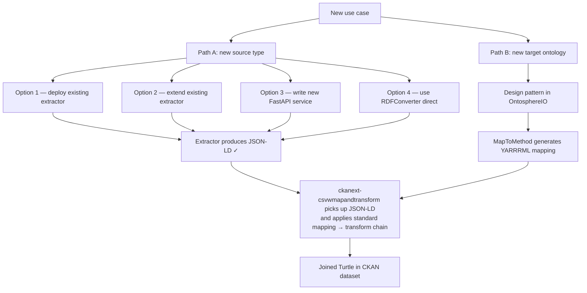

# Add a Use Case

Extend the DataStack pipeline for a new data domain. Two independent dimensions to adapt: the **source type** (what data you bring in) and the **target ontology** (what knowledge graph you produce).

---

## Decision tree



Most new use cases involve both dimensions — a new instrument format and a new ontology structure. They can be worked on independently and combined at the end.

---

## Path A — New Source Type

The pipeline accepts anything that produces JSON-LD or RDF. Four options are available depending on the situation:

**Option 1: Deploy an existing extractor**

If a Mat-O-Lab extractor already handles your instrument or data source, deploy it as a sidecar service and register its CKAN plugin.

| Data source | Extractor | Status |
|---|---|---|
| CSV / ASC / TSV | CSVToCSVW (included in DataStack) | Production |
| OMERO microscopy server | [OmeroExtractor](https://github.com/Mat-O-Lab/OmeroExtractor) | Early stage |
| OpenBIS ELN/LIMS | [OpenBISmantic](https://github.com/Mat-O-Lab/OpenBISmantic) | Demonstrator |

Deploy the extractor service separately and add the respective `ckanext-*` plugin name to `CKAN__PLUGINS` in `.env`.

---

**Option 2: Extend an existing extractor**

If your data source is structurally similar to one of the above (e.g. a different OMERO version or a different OpenBIS schema), fork the existing extractor repo, adjust the parsing logic, and rebuild the Docker image. The external API contract the extractor must honour is:

- Accept a source URL (or file upload) as input
- Return JSON-LD at a publicly accessible URL

No changes to CKAN extensions or the rest of the pipeline are needed.

---

**Option 3: Write a new FastAPI service**

For entirely new instrument types, implement a FastAPI service that converts the raw file format to JSON-LD. Minimal interface:

```python
# Minimal contract: GET /api/convert?url=<source_url> → JSON-LD response
@app.get("/api/convert")
def convert(url: str) -> dict:
    # parse raw data at `url`, return as JSON-LD
    ...
```

Once the service returns JSON-LD, `ckanext-csvwmapandtransform` picks it up automatically — the rest of the pipeline is unchanged. Add a CKAN extension that calls your service `after_resource_create` (follow the same pattern as `ckanext-csvtocsvw`).

---

**Option 4: Use RDFConverter direct (no extractor step)**

If the source is already JSON or XML, write a YARRRML mapping that reads it directly using a JSONPath or XPath iterator. No extractor service is needed.

```yaml
# YARRRML mapping reading from a JSON source with a JSONPath iterator
mappings:
  MaterialData:
    sources:
      - ["https://example.org/data.json~jsonpath", "$.measurements[*]"]
    subjects: "ex:measurement_$(id)"
    predicates-objects:
      - predicates: pmdco:hasValue
        objects: "$(tensile_strength)"
```

Upload this mapping to the CKAN `mappings` group and add `json` to `CKANINI__CKANEXT__CSVWMAPANDTRANSFORM__FORMATS` so the extension processes JSON resources. See the [YARRRML tutorial](https://rml.io/yarrrml/tutorial/) for iterator syntax.

---

## Path B — New Target Ontology

The target ontology lives entirely in the YARRRML mapping and the pattern (template graph). The pipeline infrastructure is never touched.

**Step 1: Design a pattern in OntosphereIO**

[OntosphereIO](https://github.com/ThHanke/ontosphere) is the recommended pattern authoring tool — browser-based, AI-assisted, full OWL2DL reasoning and PMDCO autoshapes (SHACL). The [PMDCO pattern library](https://github.com/materialdigital/core-ontology/tree/main/patterns/) has reusable reference patterns.

Patterns are Turtle RDF files. A minimal pattern defines:

- The target ontology class (e.g., `pmdco:TensileTestResult`)
- Named individuals for each measured property
- QUDT unit annotations where applicable

**Step 2: Generate a YARRRML mapping with MapToMethod**

Use MapToMethod with your CSVW JSON-LD and new pattern Turtle — it generates the YARRRML rules automatically. See [Author a Mapping](author-a-mapping.md) for the step-by-step workflow.

**Step 3: Choose the right transformation path**

| Situation | Transformation path |
|---|---|
| Source data maps directly to target ontology | YARRRML/RML (direct) — default for CSV |
| Source has its own ontology (e.g. SAMM/Catena-X) that differs structurally from target | YARRRML/RML → intermediate Fuseki graph → SPARQL CONSTRUCT |

Use SPARQL CONSTRUCT only when the intermediate ontology is complex enough that mapping rules alone cannot bridge the gap. It requires authoring a SPARQL CONSTRUCT query stored as a CKAN resource. See [SAMM / Catena-X two-stage pipeline](../pipeline/advanced/samm-catena-x.md) for a worked example.

---

## Configuration changes

Each path requires different configuration keys. Use this table to identify what to set in your `.env`:

| Path | Config key (`CKANINI__` prefix) | What to change | Default |
|---|---|---|---|
| Path A (new source type, Option 1–3) | `CKAN__PLUGINS` | Add the new extractor plugin name | (core plugins only) |
| Path A (any option) | `CKANINI__CKANEXT__CSVWMAPANDTRANSFORM__FORMATS` | Add the extractor's output format if not already listed (e.g. `json json-ld`) | `json json-ld turtle n3 nt hext trig longturtle xml ld+json` |
| Path A (Option 4, CSV/ASC sources) | `CKANINI__CKANEXT__CSVTOCSVW__FORMATS` | Add the new source file extension | (csv, asc, tsv) |
| Both paths (development) | `CKANINI__CKANEXT__CSVWMAPANDTRANSFORM__MAPPING_STRATEGY` | Set to `best_match` while iterating — switch to `exact` for production | `exact` |

Configuration snippet for enabling a new extractor plugin and a new format:

```bash
# .env
CKAN__PLUGINS=... ckanext_myextractor
CKANINI__CKANEXT__CSVWMAPANDTRANSFORM__FORMATS=json json-ld turtle n3 nt hext trig longturtle xml ld+json myformat
CKANINI__CKANEXT__CSVWMAPANDTRANSFORM__MAPPING_STRATEGY=best_match
```

Switch `MAPPING_STRATEGY` back to `exact` once `rules_skipped == 0` for all your mappings.

See [Configuration Reference](../reference/configuration.md) for all keys and their `CKANINI__` env forms.

---

## Done checklist

When extending the pipeline for a new use case, verify all three before declaring it complete:

- [ ] **Extractor produces JSON-LD** — call the extractor service directly and confirm the response is valid JSON-LD with an `@context` block.
- [ ] **`rules_skipped == 0`** — run `/api/checkmapping` against your CSVW and mapping; both `rules_applicable > 0` and `rules_skipped == 0` must hold.
- [ ] **Joined Turtle visible in CKAN** — upload a test CSV to CKAN and confirm a `*-joined.ttl` resource appears in the same dataset within a few seconds (background job execution time).

---

## Next steps

- **Author a mapping for your new pattern:** [Author a Mapping](author-a-mapping.md)
- **Two-stage SPARQL CONSTRUCT pipeline:** [SAMM / Catena-X](../pipeline/advanced/samm-catena-x.md)
- **Use the microservices without CKAN:** [Standalone APIs](standalone-apis.md)
- **Reference all configuration keys:** [Configuration Reference](../reference/configuration.md)
