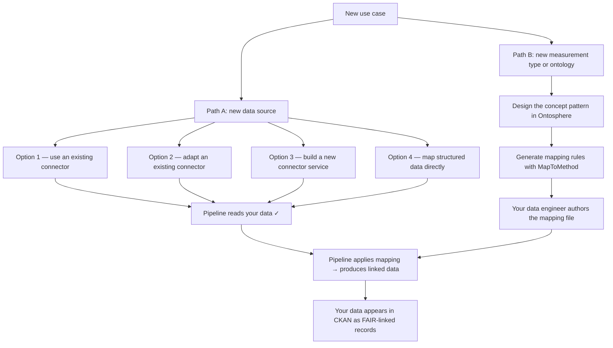

# Add a Use Case

The DataStack pipeline is built around a concept called a **use case**: a specific combination of _where your data comes from_ and _what scientific concepts your data describes_. When you bring a new type of experiment or measurement into the pipeline, you are adding a use case.

Your data describes a tensile test — but the pipeline needs to know what "yield strength" means in a way any computer can understand. A **mapping file** is the bridge. This guide explains how to extend the pipeline for a new data source or a new kind of measurement, and where to go for each step.

---

## Two questions that define your use case

Every new use case comes down to two independent questions:

1. **Where does the data come from?** — which instrument, software, or system produces it?
2. **What does the data describe?** — which scientific concepts (test types, measured properties, material classes) should the pipeline capture?

You can answer these questions independently and combine the results later. Most new use cases involve both.

---

## Decision map

---

## Path A — New data source

The pipeline needs to read your raw files and convert them into a form it can work with. This conversion step is handled by a **connector** (sometimes called an extractor). If a connector already exists for your instrument or software, you do not need to write any code.

### Option 1: Use an existing connector

Check whether a connector already exists for your data source:

| Data source | Connector | Status |
|---|---|---|
| CSV, ASC, TSV files (from most instruments) | CSVToCSVW — included in DataStack | Production |
| OMERO microscopy server | [OmeroExtractor](https://github.com/Mat-O-Lab/OmeroExtractor) | Early stage |
| OpenBIS electronic lab notebook / LIMS | [OpenBISmantic](https://github.com/Mat-O-Lab/OpenBISmantic) | Demonstrator |

If your data source is on this list, ask your data engineer or system administrator to enable the connector. You do not need to do anything in the pipeline itself — once the connector is active, your files will be processed automatically when you upload them to CKAN.

### Option 2: Adapt an existing connector

If your instrument is _similar_ to one on the list above — for example, a different version of OMERO or an OpenBIS instance with a custom schema — a data engineer can adapt the existing connector rather than building a new one. Share a sample file and a description of your instrument's export format with your data engineer.

### Option 3: Build a new connector service

For an entirely new instrument or software system with no existing connector, a developer can build a dedicated conversion service. The only requirement is that the service reads your raw files and converts them to a standard linked-data format. Once it does that, the rest of the pipeline works unchanged.

Share example output files from your instrument and a description of the measurement fields they contain. A developer or data engineer will handle the implementation.

### Option 4: Map structured data directly

If your data is already in a well-structured format — such as JSON or XML with clearly named fields — it may be possible to write a mapping file that reads it directly, without a separate connector step.

In this case, the data engineer authors a mapping file that points to your JSON or XML source. See [Author a Mapping](author-a-mapping.md) for what that process looks like.

---

## Path B — New measurement type or target ontology

Even if the pipeline can already read your files (Path A is covered), it may not yet _understand_ what your data means scientifically. Teaching the pipeline what "yield strength" or "crystallite size" means requires two things: a **concept pattern** and a **mapping file**.

**What is a concept pattern?**
A concept pattern is a small formal description of how the scientific concepts in your data relate to each other — for example, that a tensile test produces a specimen, that a specimen has a measured yield strength, and that yield strength is expressed in megapascals. The pattern is not about your specific CSV file; it is about the structure of the measurement type itself.

**What is a mapping file?**
A mapping file connects the column names in your CSV to the concepts in the pattern. It tells the pipeline: "the column labelled `ys_MPa` in this file represents yield strength of the specimen described in column `sample_id`."

You do not write either of these yourself. Here is how the process works:

### Step 1: Describe your measurement to your data engineer

Give your data engineer a sample CSV and a plain-language description of what each column means — in the vocabulary you use in the lab. For example:

> "Column A is the specimen ID. Column B is maximum force in Newtons. Column C is yield strength in MPa. The test is a DIN EN ISO 6892-1 tensile test."

This description, not the CSV itself, is the starting point for building the pattern.

### Step 2: Pattern design in Ontosphere

Your data engineer or ontology specialist will use [Ontosphere](https://github.com/ThHanke/ontosphere) — a browser-based tool — to draw the concept structure for your measurement type. The [PMDCO pattern library](https://github.com/materialdigital/core-ontology/tree/main/patterns/) contains reference patterns for common materials science measurements that can be reused or extended.

You may be asked to review the pattern to confirm it correctly represents the scientific concepts in your data.

### Step 3: Mapping file authoring

Once the pattern is in place, a data engineer will author the mapping file that connects your CSV columns to the concept pattern. The mapping file is the technical artifact that drives the transformation.

**This step is handled by your data engineer — see [Author a Mapping](author-a-mapping.md) for the full workflow.** You do not need to understand the mapping syntax to participate in this step, but your data engineer will need your domain expertise to get the column meanings right.

### Choosing the right transformation approach

Most measurements map directly from CSV columns to concept patterns. For more complex cases — such as data that already arrives with its own ontology structure (for example, data from Catena-X or SAMM-based systems) — a two-stage approach is used where the data is first converted to an intermediate form, then aligned to the target concepts. Your data engineer will advise which approach fits your data source. See [SAMM / Catena-X two-stage pipeline](../pipeline/advanced/samm-catena-x.md) for an example.

---

## What your data engineer will configure

Each new use case typically requires a small number of configuration changes to the running DataStack instance. Your data engineer or operator will handle these. The table below lists the common changes so you can have an informed conversation:

| What changes | When it is needed | Who makes the change |
|---|---|---|
| Enable a new connector plugin | When adding an extractor for a new data source (Option 1–3) | Operator / data engineer |
| Register a new file type with the pipeline | When the pipeline should process a new file extension | Operator / data engineer |
| Switch matching strategy to `best_match` during development | While iterating on a new mapping before it is finalised | Data engineer |
| Switch matching strategy back to `exact` for production | When the mapping is complete and validated | Data engineer |

If you are a data engineer or operator making these changes yourself, see the [Configuration Reference](../reference/configuration.md) for the exact environment variable names and values.

---

## Done checklist

A new use case is complete when these three things are true:

- [ ] **The pipeline reads your files** — upload a sample file to CKAN and confirm the pipeline processes it without errors.
- [ ] **The mapping covers all fields** — your data engineer confirms the mapping has no skipped rules; every column you care about is represented.
- [ ] **Linked data appears in CKAN** — after uploading a test file, a linked-data record (shown as a `.ttl` resource) appears in the same CKAN dataset within a few seconds.

---

## Next steps

- **Author a mapping for your measurement type:** [Author a Mapping](author-a-mapping.md)
- **Two-stage pipeline for data with its own ontology structure:** [SAMM / Catena-X](../pipeline/advanced/samm-catena-x.md)
- **Use the microservices without CKAN:** [Standalone APIs](standalone-apis.md)
- **Reference all configuration keys:** [Configuration Reference](../reference/configuration.md)
