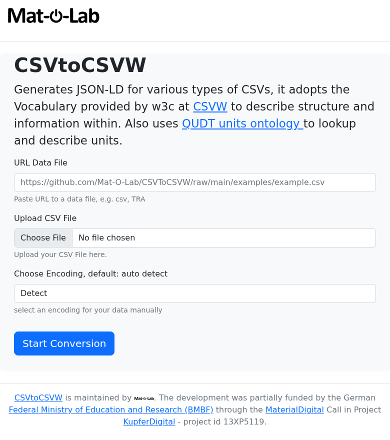
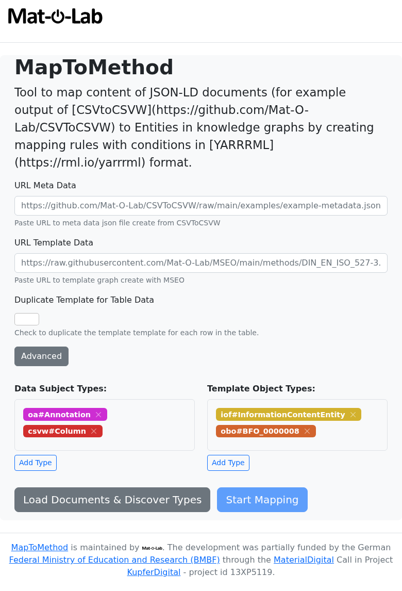
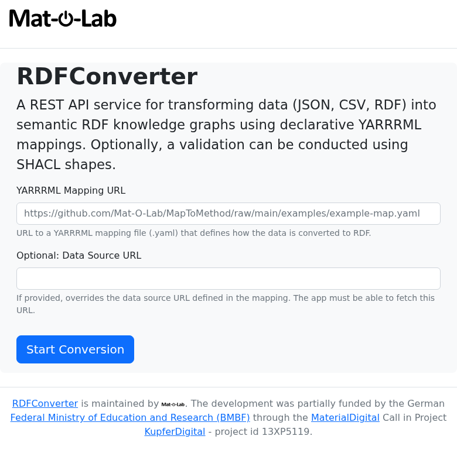

# Use the Data Tools Directly

Upload your CSV. Get FAIR-compliant data back. No CKAN account required.

The Mat-O-Lab data tools run as public web services. You can submit a CSV file — say, a tensile test table from your lab — and receive a structured, machine-readable output within seconds. This guide walks you through each tool and a complete worked example using real steel measurement data.

---

## What you need before you start

- Your CSV file, or a public link to it (e.g. a GitHub raw URL or a direct download link from your lab system)
- A mapping file (.yaml) — either one your data curator has prepared for you, or one generated by MapToMethod (see below)

No installation. No account. No command-line knowledge needed.

---

## The three tools

| Tool | What it does | Web UI | API explorer |
|---|---|---|---|
| **CSVToCSVW** | Reads your CSV and adds structured column descriptions | [csvtocsvw.matolab.org](https://csvtocsvw.matolab.org/) | [/api/docs](https://csvtocsvw.matolab.org/api/docs) |
| **MapToMethod** | Generates the mapping file that links your columns to standard concepts | [maptomethod.matolab.org](https://maptomethod.matolab.org/) | [/api/docs](https://maptomethod.matolab.org/api/docs) |
| **RDFConverter** | Applies the mapping and produces FAIR-compliant output | [rdfconverter.matolab.org](https://rdfconverter.matolab.org/) | [/api/docs](https://rdfconverter.matolab.org/api/docs) |

Run them in order — CSVToCSVW first, RDFConverter last. MapToMethod is needed only when setting up a new measurement type.

---

## Step 1 — Annotate your CSV (CSVToCSVW)

Go to **[csvtocsvw.matolab.org](https://csvtocsvw.matolab.org/)**.



You will see a form with a field labelled **URL Data File**.

Paste the URL of your CSV file into that field, then click **Execute**.

The service reads your CSV columns (names, units, separators) and returns an annotated description file in JSON-LD format — a standard way of attaching meaning to your data. Save this file; you will need it in Step 3.

**Worked example — INSTRON tensile test data**

This real CSV from the IOFMaterialsTutorial repository contains three columns: Zeit [s], Maschine [mm], and Kraft [kN] — time, displacement, and force from a steel tensile test.

??? example "Try it yourself — Step 1: Annotate a CSV"

    === "Web UI"

        1. Open **[csvtocsvw.matolab.org](https://csvtocsvw.matolab.org/)**
        2. Find the **annotate** form
        3. Fill **data_url**:
           ```
           https://github.com/Mat-O-Lab/CSVToCSVW/raw/main/examples/example2.csv
           ```
        4. Leave **encoding** as `auto`
        5. Click **Execute**

        The response is a JSON-LD file — your CSVW. Save it or copy the URL from the response header; you need it in Step 3.

        **Local file?** Use the **annotate_upload** form instead — upload the file directly. Same result, no public URL needed.

    === "curl"

        ```bash
        curl -X POST "https://csvtocsvw.matolab.org/api/annotate?return_type=json-ld" \
          -H "Content-Type: application/json" \
          -d '{"data_url": "https://github.com/Mat-O-Lab/CSVToCSVW/raw/main/examples/example2.csv",
               "encoding": "auto"}' \
          --output example2-metadata.json
        ```

        For a local file:

        ```bash
        curl -X POST "https://csvtocsvw.matolab.org/api/annotate_upload?return_type=json-ld" \
          -F "file=@/path/to/your/sample.csv" \
          --output sample.csvw.json
        ```

        ✓ **Expected:** a JSON-LD file with `@type: csvw#TableGroup` and columns each carrying a `qudt:unit` annotation.

---

## Step 2 — Explore column types (MapToMethod)

!!! note "When to use this step"
    This step is used when setting up a new type of measurement — to understand what standard concepts your columns correspond to. If your data curator has already prepared a mapping file for your measurement type, you can skip to Step 3.

Go to **[maptomethod.matolab.org](https://maptomethod.matolab.org/)**.



The **types** form shows you which categories of scientific concepts appear in your annotated file. The **entities** form lists your individual columns with their internal names — the identifiers you will need when building a mapping.

??? example "Try it yourself — Step 2: Explore column types"

    === "Web UI"

        1. Open **[maptomethod.matolab.org](https://maptomethod.matolab.org/)**
        2. Find the **types** form
        3. Fill **url**:
           ```
           https://raw.githubusercontent.com/Mat-O-Lab/IOFMaterialsTutorial/main/measurements-metadata.json
           ```
        4. Click **Execute**

        The result lists RDF type IRIs found in the file — e.g. `csvw#Column`, `qudt/DerivedUnit`. This tells you what the service can map.

        To generate a mapping, use the **mapping** form. You need the CSVW URL, a template `.ttl` URL (from your data curator), and a column-to-slot assignment. See [Author a Mapping](author-a-mapping.md) for the full walkthrough.

    === "curl"

        Explore types:

        ```bash
        curl "https://maptomethod.matolab.org/api/types?url=https://raw.githubusercontent.com/Mat-O-Lab/IOFMaterialsTutorial/main/measurements-metadata.json"
        ```

        ✓ **Expected:**
        ```json
        ["http://qudt.org/schema/qudt/DerivedUnit", "http://www.w3.org/ns/csvw#Column",
         "http://www.w3.org/ns/csvw#TableGroup", "http://www.w3.org/ns/prov#Activity",
         "http://www.w3.org/ns/prov#SoftwareAgent"]
        ```

        Generate a mapping (IOFMaterialsTutorial example):

        ```bash
        curl -X POST "https://maptomethod.matolab.org/api/mapping" \
          -H "Content-Type: application/json" \
          -d '{
            "data_url":     "https://raw.githubusercontent.com/Mat-O-Lab/IOFMaterialsTutorial/main/measurements-metadata.json",
            "template_url": "https://github.com/Mat-O-Lab/IOFMaterialsTutorial/raw/main/LengthMeasurement.ttl",
            "predicate":    "http://purl.obolibrary.org/obo/RO_0010002",
            "map": {
              "table-1-LengthMm": "https://github.com/Mat-O-Lab/IOFMaterialsTutorial/raw/main/LengthMeasurement.ttl/LengthData"
            }
          }' \
          --output my-mapping.yaml
        ```

        ✓ **Expected:** a YARRRML `.yaml` file ready for use in Step 3.

See [Author a Mapping](author-a-mapping.md) for a full walkthrough of building the mapping from scratch.

---

## Step 3 — Convert to FAIR data (RDFConverter)

Go to **[rdfconverter.matolab.org](https://rdfconverter.matolab.org/)**.



**First, validate your mapping (recommended):**

Use the **checkmapping** form. Paste the URL of your CSVW file and the URL of your mapping file into the two fields, then click **Execute**.

The result shows two numbers:

- `rules_applicable` — how many mapping rules matched your data
- `rules_skipped` — how many rules were skipped because they did not match

If `rules_skipped` is 0, everything matched. If it is greater than 0, check [Author a Mapping — Troubleshooting](author-a-mapping.md#troubleshooting) before continuing.

**Then, produce the output:**

Use the **createrdf** form. Paste the mapping URL and choose **turtle** as the return type, then click **Execute**.

!!! tip "Try an existing mapping on your own data"
    The **Optional: Data Source URL** field lets you override the data URL that is hardcoded inside the mapping file. This means you can take any published mapping (e.g. from the real datasets table below), point it at your own similarly-formatted CSVW, and test whether the mapping works for your data — without modifying the mapping file at all. Leave the field empty to use the data URL embedded in the mapping.

    This is also exactly how the CKAN integration works. For CSV uploads, CKAN generates the CSVW and then calls RDFConverter with the mapping URL and the CSVW URL as the data source override. For Catena-X JSON payloads, CKAN passes the actual JSON file URL as the override — this is what lets a single SAMM mapping file apply to every incoming payload and automatically identify which SAMM aspect model it belongs to.

The service applies the mapping and returns a .ttl file — a FAIR knowledge graph. This file contains your measurement data enriched with standardised scientific concepts, ready for sharing, archiving, or querying.

??? example "Try it yourself — Step 3: Validate and convert"

    === "Web UI"

        **Validate first (recommended):**

        1. Open **[rdfconverter.matolab.org](https://rdfconverter.matolab.org/)**
        2. Find the **checkmapping** form
        3. Fill **mapping_url**:
           ```
           https://raw.githubusercontent.com/Mat-O-Lab/IOFMaterialsTutorial/main/measurements-map.yaml
           ```
        4. Fill **data_url**:
           ```
           https://raw.githubusercontent.com/Mat-O-Lab/IOFMaterialsTutorial/main/measurements-metadata.json
           ```
        5. Click **Execute**

        ✓ **Expected:** `rules_applicable: 1, rules_skipped: 0`

        **Then produce the knowledge graph:**

        1. Find the **createrdf** form
        2. Fill the same **mapping_url** and **data_url** as above
        3. Set **return_type** to `turtle`
        4. Click **Execute**

        The result is your `.ttl` knowledge graph — download or copy the content.

    === "curl"

        Validate:

        ```bash
        curl -X POST "https://rdfconverter.matolab.org/api/checkmapping" \
          -G \
          --data-urlencode "mapping_url=https://raw.githubusercontent.com/Mat-O-Lab/IOFMaterialsTutorial/main/measurements-map.yaml" \
          --data-urlencode "data_url=https://raw.githubusercontent.com/Mat-O-Lab/IOFMaterialsTutorial/main/measurements-metadata.json"
        ```

        ✓ **Expected:** `{"rules_applicable": 1, "rules_skipped": 0}`

        Convert:

        ```bash
        curl -X POST "https://rdfconverter.matolab.org/api/createrdf?return_type=turtle" \
          -G \
          --data-urlencode "mapping_url=https://raw.githubusercontent.com/Mat-O-Lab/IOFMaterialsTutorial/main/measurements-map.yaml" \
          --data-urlencode "data_url=https://raw.githubusercontent.com/Mat-O-Lab/IOFMaterialsTutorial/main/measurements-metadata.json" \
          --output measurements-joined.ttl
        ```

        ✓ **Expected:** a Turtle file with PMDco process nodes and QUDT quantity values.

---

## Real datasets to explore

These are complete, published examples you can use immediately in any of the forms above:

| Dataset | CSV file | Mapping | FAIR output |
|---|---|---|---|
| IOFMaterialsTutorial — steel length measurements | [measurements.csv](https://raw.githubusercontent.com/Mat-O-Lab/IOFMaterialsTutorial/main/measurements.csv) | [measurements-map.yaml](https://raw.githubusercontent.com/Mat-O-Lab/IOFMaterialsTutorial/main/measurements-map.yaml) | [measurements-joined.ttl](https://raw.githubusercontent.com/Mat-O-Lab/IOFMaterialsTutorial/main/measurements-joined.ttl) |
| BAMresearch DF-TEM-PAW — particle detection runs | [detection\_runs.csv](https://raw.githubusercontent.com/BAMresearch/DF-TEM-PAW/main/detection_runs.csv) | [detection\_runs-map.yaml](https://raw.githubusercontent.com/BAMresearch/DF-TEM-PAW/main/detection_runs-map.yaml) | [detection\_runs-joined.ttl](https://raw.githubusercontent.com/BAMresearch/DF-TEM-PAW/main/detection_runs-joined.ttl) |

---

## For developers and scripted pipelines

The web forms above call the same HTTP API endpoints that can be called from scripts or CI/CD pipelines. If you are comfortable with command-line tools, the sections below show how to run the same steps using `curl`.

### CSVToCSVW — annotate from URL

```bash
curl -X POST "https://csvtocsvw.matolab.org/api/annotate?return_type=json-ld" \
  -H "Content-Type: application/json" \
  -d '{"data_url": "https://github.com/Mat-O-Lab/CSVToCSVW/raw/main/examples/example2.csv",
       "encoding": "auto"}' \
  --output example2-metadata.json
```

For private (local) files, use the upload endpoint:

```bash
curl -X POST "https://csvtocsvw.matolab.org/api/annotate_upload?return_type=json-ld" \
  -F "file=@/path/to/local/sample.csv" \
  --output sample.csvw.json
```

### MapToMethod — explore types and generate a mapping

```bash
curl "https://maptomethod.matolab.org/api/types?url=https://raw.githubusercontent.com/Mat-O-Lab/IOFMaterialsTutorial/main/measurements-metadata.json"
```

```json
["http://qudt.org/schema/qudt/DerivedUnit", "http://www.w3.org/ns/csvw#Column",
 "http://www.w3.org/ns/csvw#TableGroup", "http://www.w3.org/ns/prov#Activity",
 "http://www.w3.org/ns/prov#SoftwareAgent"]
```

```bash
curl -X POST "https://maptomethod.matolab.org/api/mapping" \
  -H "Content-Type: application/json" \
  -d '{
    "data_url":     "https://raw.githubusercontent.com/Mat-O-Lab/IOFMaterialsTutorial/main/measurements-metadata.json",
    "template_url": "https://github.com/Mat-O-Lab/IOFMaterialsTutorial/raw/main/LengthMeasurement.ttl",
    "predicate":    "http://purl.obolibrary.org/obo/RO_0010002",
    "map": {
      "table-1-LengthMm": "https://github.com/Mat-O-Lab/IOFMaterialsTutorial/raw/main/LengthMeasurement.ttl/LengthData"
    }
  }' \
  --output my-mapping.yaml
```

### RDFConverter — validate and convert

```bash
curl -X POST "https://rdfconverter.matolab.org/api/checkmapping" \
  -G \
  --data-urlencode "mapping_url=https://raw.githubusercontent.com/Mat-O-Lab/IOFMaterialsTutorial/main/measurements-map.yaml" \
  --data-urlencode "data_url=https://raw.githubusercontent.com/Mat-O-Lab/IOFMaterialsTutorial/main/measurements-metadata.json"
```

```json
{"rules_applicable": 1, "rules_skipped": 0}
```

```bash
curl -X POST "https://rdfconverter.matolab.org/api/createrdf?return_type=turtle" \
  -G \
  --data-urlencode "mapping_url=https://raw.githubusercontent.com/Mat-O-Lab/IOFMaterialsTutorial/main/measurements-map.yaml" \
  --data-urlencode "data_url=https://raw.githubusercontent.com/Mat-O-Lab/IOFMaterialsTutorial/main/measurements-metadata.json"
```

```json
{
  "filename": "measurements-metadata-joined.ttl",
  "graph": "@prefix iof: ...\n<.../table-1-LengthMm> ...",
  "num_mappings_applied": 1,
  "num_mappings_skipped": 0
}
```

### Full pipeline shell script

CSV → CSVW → validate → RDF in one script, using real IOFMaterialsTutorial data:

```bash
#!/usr/bin/env bash
set -e

CSV_URL="https://raw.githubusercontent.com/Mat-O-Lab/IOFMaterialsTutorial/main/measurements.csv"
MAPPING_URL="https://raw.githubusercontent.com/Mat-O-Lab/IOFMaterialsTutorial/main/measurements-map.yaml"

# Step 1: Annotate CSV → CSVW JSON-LD
curl -s -X POST "https://csvtocsvw.matolab.org/api/annotate?return_type=json-ld" \
  -H "Content-Type: application/json" \
  -d "{\"data_url\": \"${CSV_URL}\", \"encoding\": \"auto\"}" \
  --output measurements-metadata.json
echo "✓ CSVW: measurements-metadata.json"

# Step 2: Validate mapping (dry-run)
CHECK=$(curl -s -X POST "https://rdfconverter.matolab.org/api/checkmapping" \
  -G \
  --data-urlencode "mapping_url=${MAPPING_URL}" \
  --data-urlencode "data_url=https://raw.githubusercontent.com/Mat-O-Lab/IOFMaterialsTutorial/main/measurements-metadata.json")
echo "✓ Check: ${CHECK}"

# Step 3: Apply mapping → joined RDF
curl -s -X POST "https://rdfconverter.matolab.org/api/createrdf?return_type=turtle" \
  -G \
  --data-urlencode "mapping_url=${MAPPING_URL}" \
  --data-urlencode "data_url=https://raw.githubusercontent.com/Mat-O-Lab/IOFMaterialsTutorial/main/measurements-metadata.json" \
  --output measurements-joined.ttl
echo "✓ Knowledge graph: measurements-joined.ttl"
```

---

*Next: [Full API Reference](../reference/api-endpoints.md) — all endpoints with parameters and response schemas.*
