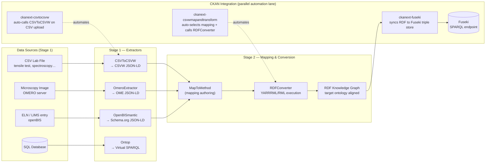

# Default Use Case — CSV Lab Data

> **Create complete, consistent metadata for a non-semantic resource — then use semantic technologies to transform that further.**

---

## Pipeline Overview

The DataStack pipeline has three parallel swim lanes. The microservice lane is the semantic core. The data source lane shows the different ingress routes. The CKAN lane shows how CKAN automates the microservice calls and stores every artifact.



The page below details the **CSV lab data path** — the default and most automated route.

---

## What is the "default use case"?

You have a CSV file from a lab instrument — tensile test results, spectroscopy measurements, material property tables. The file sits on a network drive. The DataStack turns it into a queryable, FAIR knowledge graph.

The pipeline runs **automatically** after upload. You do not write any code.

---

## The Automation Chain

Upload your CSV to CKAN and the following happens:

**Step 1 — CKAN detects the format**

The file extension (`csv`, `asc`, `tsv`, `txt`) triggers the pipeline automatically. Any other format is ignored.

**Step 2 — CKAN creates a CSVW metadata file**

The CSVToCSVW service reads your CSV and produces a [W3C CSVW](https://www.w3.org/TR/tabular-data-primer/) JSON-LD metadata document. It annotates every column with:

- A [QUDT](https://qudt.org/) unit term (e.g., `unit:MegaPA` for columns named `tensile_strength_MPa`)
- Provenance via [PROV-O](https://www.w3.org/TR/prov-o/) — recording which service produced the metadata
- Open Annotation entries for metadata rows above the data table

The new CSVW JSON-LD file appears as an additional resource in your CKAN dataset.

```json
{
  "@context": ["http://www.w3.org/ns/csvw", {
    "qudt": "http://qudt.org/schema/qudt/",
    "unit": "http://qudt.org/vocab/unit/",
    "prov": "http://www.w3.org/ns/prov#"
  }],
  "@type": "http://www.w3.org/ns/csvw#TableGroup",
  "tables": [{
    "tableSchema": {
      "columns": [
        { "name": "temperature_C",        "qudt:unit": { "@id": "unit:DEG_C" } },
        { "name": "tensile_strength_MPa", "qudt:unit": { "@id": "unit:MegaPA" } },
        { "name": "yield_strength_MPa",   "qudt:unit": { "@id": "unit:MegaPA" } },
        { "name": "elongation_pct",       "qudt:unit": { "@id": "unit:PERCENT" } }
      ]
    }
  }],
  "prov:wasGeneratedBy": { "@id": "https://csvtocsvw.matolab.org" }
}
```

*The full `sample.csvw.json` example with annotations is in `docs/examples/`.*

**Step 3 — The data table becomes queryable**

CKAN imports the CSV rows into the DataStore — the same tabular data is now accessible via CKAN's Data API and the table preview in the browser.

**Step 4 — CKAN converts CSVW to Turtle**

The JSON-LD metadata is converted to [Turtle](https://www.w3.org/TR/turtle/) RDF serialization. A second resource appears in the dataset.

**Step 5 — CKAN scans the `mappings` group**

CKAN searches its `mappings` group for YAML mapping files and tests each one against your new Turtle resource. If a mapping's rules match your column structure exactly (`exact` strategy), it is selected automatically.

See [Author a Mapping](../guides/author-a-mapping.md) to learn how to create a mapping for your data.

**Step 6 — CKAN produces the joined knowledge graph**

The selected YARRRML mapping and your Turtle data are sent to the RDFConverter service. It executes the RML rules and produces a **joined Turtle** file — your data expressed in the target ontology (e.g., [PMDco](https://github.com/materialdigital/core-ontology)):

```turtle
@prefix pmdco: <https://github.com/materialdigital/core-ontology/tree/main/pmdco#> .
@prefix qudt:  <http://qudt.org/schema/qudt/> .
@prefix unit:  <http://qudt.org/vocab/unit/> .
@prefix prov:  <http://www.w3.org/ns/prov#> .
@prefix xsd:   <http://www.w3.org/2001/XMLSchema#> .

<https://example.org/result_23>
    a pmdco:TensileTestResult ;
    pmdco:hasTensileStrength [
        a qudt:QuantityValue ;
        qudt:numericValue "180"^^xsd:double ;
        qudt:unit unit:MegaPA     # QUDT unit annotation
    ] ;
    pmdco:hasYieldStrength [
        a qudt:QuantityValue ;
        qudt:numericValue "120"^^xsd:double ;
        qudt:unit unit:MegaPA
    ] ;
    prov:wasDerivedFrom <https://example.org/sample.csv> .  # provenance statement
```

The joined Turtle resource appears in your CKAN dataset alongside the original CSV and CSVW metadata.

**Step 7 — Fuseki upload (manual)**

!!! warning "Manual step"
    The Fuseki triplestore upload is **not automatic**. Automatic sync hooks exist in the code but are currently disabled. You trigger it manually via the ckanext-fuseki button in the dataset view, or via the CKAN API.

    This is a known limitation — see [Capability Map](capability-map.md) for context.

Once triggered, the joined Turtle is loaded into a Fuseki dataset (identified by a UUID matching your CKAN dataset). CKAN adds a SPARQL resource link so you and your collaborators can query the data via Sparklis or YASGUI directly in the browser.

---

## What you end up with

After the full pipeline runs, your CKAN dataset contains four resources:

| Resource | Format | What it is |
|---|---|---|
| `yourfile.csv` | CSV | Original measurement file |
| `yourfile.csvw.json` | JSON-LD | CSVW metadata with QUDT unit annotations and PROV-O provenance |
| `yourfile.ttl` | Turtle | RDF serialization of the CSVW metadata |
| `yourfile-joined.ttl` | Turtle | Knowledge graph aligned to your target ontology |

Plus, after Fuseki upload:
- A SPARQL endpoint scoped to your dataset
- A Sparklis or YASGUI query link in the CKAN resource list

---

## Where to go next

- **Deploy the stack yourself:** [Quickstart](../guides/quickstart.md)
- **Create a mapping for your data:** [Author a Mapping](../guides/author-a-mapping.md)
- **See what resource types the pipeline supports:** [Capability Map](capability-map.md)

---

*The DataStack pipeline is described in a peer-reviewed paper: [Hanke et al. (2023)](https://link.springer.com/article/10.1007/s40192-023-00331-5).*
