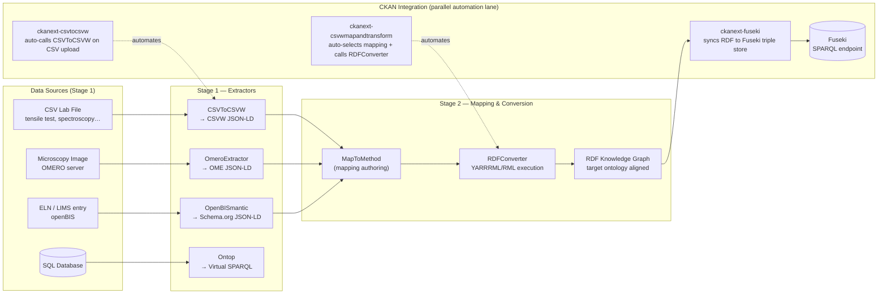

# Default Use Case — CSV Lab Data

> **Create complete, consistent metadata for a non-semantic resource — then use semantic technologies to transform that further.**

---

## Where this fits

This page describes the **core transformation path** in Block 2 — Semantic Data Foundation. DataStack takes a plain CSV file and turns it into a richly described, machine-readable dataset that meets FAIR data principles — without you writing any code.

If you are new to what "semantic" or "linked data" means and why it matters, start with [Semantic Foundation](semantic-foundation.md) first. This page focuses on what happens step by step, and what you end up with.

---

## Pipeline Overview

The DataStack pipeline has three parallel lanes working together. The diagram below shows the full picture; the rest of this page walks through the **CSV path** in detail.

- **Data Sources lane** (left): the file types the system can ingest — CSV lab files, microscopy images, database entries
- **Processing lane** (centre): the automated services that read, annotate, and transform your data
- **CKAN lane** (right): CKAN orchestrates the services automatically and stores every output as a resource in your dataset



The rest of this page details the **CSV lab data path** — the default and most automated route.

---

## What is the "default use case"?

You have a CSV file from a lab instrument — tensile test results, spectroscopy measurements, material property tables. The file sits on a network drive. DataStack turns it into a queryable, FAIR dataset that other researchers and systems can understand.

The pipeline runs **automatically** after upload. You do not write any code. The only step that requires a manual action is loading the final dataset into the query database (Step 7 below), and even that is a single button click.

---

## The Automation Chain

Upload your CSV to CKAN and the following seven steps happen:

---

**Step 1 — CKAN detects the format**

The file extension (`.csv`, `.asc`, `.tsv`, `.txt`) tells CKAN to start the pipeline. Any other format is ignored. No configuration is needed on your part.

??? example "Try it yourself — see a real uploaded dataset"

    === "Web UI"

        Browse a dataset that the pipeline has already processed:

        1. Open **[futurecarproduction.materialsdata.space](https://futurecarproduction.materialsdata.space/)**
        2. Search for **[SAMM](https://futurecarproduction.materialsdata.space/dataset?q=SAMM)** or **[microscopy](https://futurecarproduction.materialsdata.space/dataset?q=Mikroskopie)**
        3. Click any dataset — look at the **Resources** list

        You will see multiple resources for a single dataset: the original file alongside the automatically generated CSVW, Turtle, and joined files. These are the outputs of Steps 2–6 running automatically after the original file was uploaded.

    === "What triggers it"

        Upload any file with these extensions to a CKAN instance running DataStack and the pipeline starts automatically:

        ```
        .csv   .asc   .tsv   .txt
        ```

        Any other extension (`.xlsx`, `.pdf`, `.zip`) is stored as-is with no pipeline processing.

---

**Step 2 — CKAN creates a column-description file**

A service called CSVToCSVW reads your CSV and produces a companion metadata document. This file — called a **CSVW file** (short for "CSV on the Web", a [W3C standard](https://www.w3.org/TR/tabular-data-primer/)) — annotates every column with:

- **Standard unit labels.** Column names like `tensile_strength_MPa` are matched to internationally recognised measurement unit identifiers from [QUDT](https://qudt.org/) — a public vocabulary of physical quantities and units. This makes the column machine-readable to any system that understands units.
- **Provenance.** A record of which service produced the file, following the [PROV-O](https://www.w3.org/TR/prov-o/) standard. Think of it as a digital audit trail.
- **Annotation rows.** Any header rows above your data table are preserved as structured annotations.

??? example "Try it yourself — see what CSVToCSVW produces"

    === "Web UI"

        1. Open **[csvtocsvw.matolab.org](https://csvtocsvw.matolab.org/)**
        2. Find the **annotate** form
        3. Fill **data_url**:
           ```
           https://github.com/Mat-O-Lab/CSVToCSVW/raw/main/examples/example2.csv
           ```
        4. Click **Execute**

        You will see the JSON-LD output — every column now carries a `qudt:unit` identifier and a normalised name. This is exactly what CKAN generates automatically when you upload a CSV.

    === "curl"

        ```bash
        curl -X POST "https://csvtocsvw.matolab.org/api/annotate?return_type=json-ld" \
          -H "Content-Type: application/json" \
          -d '{"data_url": "https://github.com/Mat-O-Lab/CSVToCSVW/raw/main/examples/example2.csv",
               "encoding": "auto"}' \
          --output example2-metadata.json
        ```

        ✓ **Expected:** JSON-LD with `csvw#TableGroup` and columns annotated with QUDT unit IRIs.

The CSVW file appears as a new resource in your CKAN dataset. The excerpt below is from the real [`example2-metadata.json`](https://raw.githubusercontent.com/Mat-O-Lab/CSVToCSVW/main/examples/example2-metadata.json) produced by CSVToCSVW for a typical lab instrument export — German-language headers, multi-channel measurement data. You do not need to understand this format — it is produced entirely automatically:

```json
{
  "@context": [
    "http://www.w3.org/ns/csvw",
    {
      "oa":   "http://www.w3.org/ns/oa#",
      "qudt": "http://qudt.org/schema/qudt/",
      "prov": "http://www.w3.org/ns/prov#",
      "csv":  "https://github.com/Mat-O-Lab/CSVToCSVW/raw/main/examples/example2.csv/"
    }
  ],
  "@type": "http://www.w3.org/ns/csvw#TableGroup",
  "notes": [{
    "@id": "csv:Probe0",
    "@type": "oa:Annotation",
    "label": "Probe",
    "oa:hasBody": [{ "oa:value": "AWA_3_03_Rz" }]
  }],
  "tables": [{
    "tableSchema": {
      "columns": [
        {
          "name": "MaschineMm",
          "titles": ["Maschine [mm]", "MaschineMm"],
          "qudt:unit": { "@id": "http://qudt.org/vocab/unit/MilliM" }
        },
        {
          "name": "KraftKn",
          "titles": ["Kraft [kN]", "KraftKn"],
          "qudt:unit": { "@id": "http://qudt.org/vocab/unit/KiloN" }
        }
      ]
    }
  }]
}
```

*The original header `"Kraft [kN]"` is preserved alongside the normalised name `"KraftKn"`, and the column now carries `unit:KiloN` — an internationally agreed identifier for kilonewtons. The metadata row `"Probe"` with its specimen identifier is captured as an `oa:Annotation`. Everything is produced automatically from the CSV.*

---

**Step 3 — The data table becomes browsable**

CKAN imports the CSV rows into its built-in data store. Your measurements are now accessible through a table preview in the browser — you can sort, filter, and explore the numbers without downloading anything.

??? example "Try it yourself — browse raw measurement data in the portal"

    === "Web UI"

        1. Open **[dataportal.material-digital.de/dataset?q=tensile+tests](https://dataportal.material-digital.de/dataset?q=tensile+tests)**
        2. Open any dataset and click the **CSV resource** (not the `.ttl` files)
        3. Click **Preview** or **Explore → Data Explorer**

        You can sort columns, filter rows, and page through the data without downloading. This is the raw measurement table — Steps 4–6 are what turn it into linked data.

---

**Step 4 — CKAN converts the column-description file to linked-data format**

The column-description file is converted into a format called **Turtle** — a compact notation for linked data (structured information where every concept and relationship has a stable, web-addressable identifier). A second resource file appears in the dataset. This file is the input for the mapping step.

You do not need to work with this file directly.

??? example "Try it yourself — inspect the CSVW that gets converted"

    === "Web UI"

        The CSVW JSON-LD produced in Step 2 is the input for this conversion. Open the interactive API explorer and inspect it directly:

        1. Open **[csvtocsvw.matolab.org/api/docs](https://csvtocsvw.matolab.org/api/docs)**
        2. Find the **POST /api/annotate** endpoint and click **Try it out**
        3. Fill **data_url**:
           ```
           https://github.com/Mat-O-Lab/CSVToCSVW/raw/main/examples/example2.csv
           ```
        4. Click **Execute** — examine the response body

        The JSON-LD you see here is what CKAN converts to Turtle in this step. The conversion preserves all content; only the syntax changes from JSON-LD to Turtle notation.

    === "curl"

        Fetch the existing CSVW for the IOFMaterialsTutorial (already produced by Step 2):

        ```bash
        curl https://raw.githubusercontent.com/Mat-O-Lab/IOFMaterialsTutorial/main/measurements-metadata.json | python3 -m json.tool
        ```

        The `qudt:unit` and `titles` fields per column are what the mapping step in Steps 5–6 uses to match and transform your data.

---

**Step 5 — CKAN identifies what the data is about**

CKAN searches its `mappings` group — a library of rule files, each encoding the semantic structure of one data type (tensile test, TEM detection run, Catena-X material record, …). It tests each rule file against your column structure. When one matches, two things happen simultaneously:

1. The pipeline knows *which rule file to apply* — no manual selection needed.
2. The pipeline knows *what kind of measurement or process this data represents* — the matched rule file carries that semantic identity.

!!! note "Matching = identification"
    The rule file is not just a transformation recipe. It is the pipeline's way of recognising what your data is about. Every column name, unit annotation, and structural pattern in your CSV narrows the match until only one rule file fits. This is what makes the pipeline self-organising: upload data in a known format and the pipeline classifies and enriches it automatically.

These rule files are what data engineers author once per data type. See [Author a Mapping](../guides/author-a-mapping.md) if your data needs a new rule file.

??? example "Try it yourself — test a mapping against a CSVW"

    === "Web UI (API explorer)"

        1. Open **[rdfconverter.matolab.org/api/docs](https://rdfconverter.matolab.org/api/docs)**
        2. Find **POST /api/checkmapping** and click **Try it out**
        3. Fill **mapping_url**:
           ```
           https://raw.githubusercontent.com/Mat-O-Lab/IOFMaterialsTutorial/main/measurements-map.yaml
           ```
        4. Fill **data_url**:
           ```
           https://raw.githubusercontent.com/Mat-O-Lab/IOFMaterialsTutorial/main/measurements-metadata.json
           ```
        5. Click **Execute**

        ✓ **Expected:** `{"rules_applicable": 1, "rules_skipped": 0}` — the mapping matched.

        Now swap the mapping URL for one from a *different* data type (e.g. the BAMresearch detection runs mapping) and run again — you will see `rules_applicable: 0`, which is exactly what CKAN sees when it rejects a non-matching rule file and moves on to the next one in the library.

        **SAMM / Catena-X payload?** The same `/api/checkmapping` endpoint works for JSON payloads too. Provide a SAMM mapping URL and a raw JSON payload URL in the **data_url** field to test whether a SAMM mapping applies to your payload structure.

    === "curl"

        Matching mapping:

        ```bash
        curl -X POST "https://rdfconverter.matolab.org/api/checkmapping" \
          -G \
          --data-urlencode "mapping_url=https://raw.githubusercontent.com/Mat-O-Lab/IOFMaterialsTutorial/main/measurements-map.yaml" \
          --data-urlencode "data_url=https://raw.githubusercontent.com/Mat-O-Lab/IOFMaterialsTutorial/main/measurements-metadata.json"
        ```

        Non-matching mapping (different data type):

        ```bash
        curl -X POST "https://rdfconverter.matolab.org/api/checkmapping" \
          -G \
          --data-urlencode "mapping_url=https://raw.githubusercontent.com/BAMresearch/DF-TEM-PAW/main/detection_runs-map.yaml" \
          --data-urlencode "data_url=https://raw.githubusercontent.com/Mat-O-Lab/IOFMaterialsTutorial/main/measurements-metadata.json"
        ```

        ✓ **Expected for mismatch:** `{"rules_applicable": 0, "rules_skipped": 11}` — CKAN skips this mapping and tries the next one.

---

**Step 6 — CKAN produces the linked dataset**

The matching rule file and your data are sent to a transformation service. It applies the rules and produces a **joined linked-data file** — your measurements expressed using a shared materials science vocabulary called [PMDco](https://github.com/materialdigital/core-ontology) (Platform MaterialDigital Core Ontology). This means concepts like "tensile test result" or "yield strength" now carry the same identifier they would in any other dataset that uses PMDco — making your data directly comparable and combinable with other labs' data.

??? example "Try it yourself — run the full conversion"

    === "Web UI"

        1. Open **[rdfconverter.matolab.org](https://rdfconverter.matolab.org/)**
        2. Find the **checkmapping** form and fill:
           - **mapping_url**: `https://raw.githubusercontent.com/Mat-O-Lab/IOFMaterialsTutorial/main/measurements-map.yaml`
           - **data_url**: `https://raw.githubusercontent.com/Mat-O-Lab/IOFMaterialsTutorial/main/measurements-metadata.json`
        3. Click **Execute** — verify `rules_skipped: 0`
        4. Find the **createrdf** form, same two URLs, set **return_type** to `turtle`, click **Execute**

        The result is the FAIR knowledge graph — the same file CKAN stores as `yourfile-joined.ttl`.

    === "curl"

        ```bash
        # Validate
        curl -X POST "https://rdfconverter.matolab.org/api/checkmapping" \
          -G \
          --data-urlencode "mapping_url=https://raw.githubusercontent.com/Mat-O-Lab/IOFMaterialsTutorial/main/measurements-map.yaml" \
          --data-urlencode "data_url=https://raw.githubusercontent.com/Mat-O-Lab/IOFMaterialsTutorial/main/measurements-metadata.json"

        # Convert
        curl -X POST "https://rdfconverter.matolab.org/api/createrdf?return_type=turtle" \
          -G \
          --data-urlencode "mapping_url=https://raw.githubusercontent.com/Mat-O-Lab/IOFMaterialsTutorial/main/measurements-map.yaml" \
          --data-urlencode "data_url=https://raw.githubusercontent.com/Mat-O-Lab/IOFMaterialsTutorial/main/measurements-metadata.json" \
          --output measurements-joined.ttl
        ```

        ✓ **Expected:** Turtle file with PMDco process nodes (`co:AgingProcess`, etc.) and QUDT quantity values. Compare it to the table in the next section.

The joined file appears in your CKAN dataset. The excerpt below is from the real [`detection_runs-joined.ttl`](https://raw.githubusercontent.com/BAMresearch/DF-TEM-PAW/main/detection_runs-joined.ttl) — a pipeline output from BAMresearch TEM microscopy detection data. The structure is the same regardless of data type: PMDco process and quality nodes, QUDT quantity values, provenance links.

```turtle
@prefix co:    <https://w3id.org/pmd/co/> .
@prefix qudt:  <http://qudt.org/schema/qudt/> .
@prefix qunit: <http://qudt.org/vocab/unit/> .
@prefix prov:  <http://www.w3.org/ns/prov#> .

row0:ArtificalAging a co:AgingProcess ;
    co:input  row0:specimenAgingTemperature,
              row0:specimenAgingTime ;
    co:output row0:transmissionElectronMicroscopeSpecimen ;
    co:nextProcess row0:darkfieldTransmissionElectronMicroscopyImaging .

ns1:table-1-AgingTempC
    [ a qudt:QuantityValue ;
      qudt:unit  qunit:DEG_C ;
      qudt:value 1.9e+02 ] .
```

*Each measurement is now a typed PMDco process node (`co:AgingProcess`) with typed inputs and outputs. Numeric values carry QUDT unit identifiers (`qunit:DEG_C`). The same structure applies to tensile tests, composition measurements, or any other data type — only the process class and property IRIs change.*

---

**Step 7 — Load into the query database (manual)**

!!! warning "Manual step"
    Loading your linked dataset into the query database is **not automatic**. Automatic sync is implemented in the code but currently disabled. You trigger it with a single button in the CKAN dataset view — no commands or technical steps needed.

    This is a known limitation — see [Capability Map](capability-map.md) for context.

Once triggered, ckanext-fuseki loads your linked dataset into a Fuseki named graph scoped to that dataset and registers a SPARQL endpoint at:

```
https://<CKAN_HOST>/dataset/<dataset-id>/fuseki/sparql
```

This URL is saved as a resource in your CKAN dataset — it appears alongside the CSV, CSVW, and Turtle files in the resource list. Access follows CKAN's own authorisation rules: users with read permission on a private dataset can issue `SELECT`/`CONSTRUCT`/`ASK` queries; public datasets accept unauthenticated `GET` queries. Write operations (`INSERT`, `DELETE`, `UPDATE`) are always restricted to authorised users.

CKAN also adds a **Query** button to the dataset view. Clicking it opens **Sparklis** — a sentence-building query interface deployed as its own container. Sparklis lets you explore and filter the knowledge graph by clicking concepts and properties rather than writing SPARQL by hand, and it includes a YASGUI panel for raw SPARQL editing when you need it.

??? example "Try it yourself — query the knowledge graph"

    === "Web UI (Sparklis)"

        1. Open any DataStack dataset that has been loaded into Fuseki
        2. Click the **Query** button in the dataset view — Sparklis opens with the endpoint pre-filled
        3. Click any concept in the left panel to start building a query by sentence — e.g. click a PMDco class to list all instances of that type
        4. Switch to the **YASGUI** tab for raw SPARQL

        Or query the SPARQL endpoint directly in YASGUI: paste the dataset's `/fuseki/sparql` URL as the endpoint and run:

        ```sparql
        PREFIX co: <https://w3id.org/pmd/co/>
        SELECT DISTINCT ?type (COUNT(?s) AS ?count)
        WHERE { ?s a ?type . FILTER(STRSTARTS(STR(?type), "https://w3id.org/pmd/co/")) }
        GROUP BY ?type
        ORDER BY DESC(?count)
        LIMIT 20
        ```

        Each row is a PMDco class present in the dataset — the pipeline's semantic classification of your measurements.

    === "curl"

        Public datasets accept unauthenticated GET queries:

        ```bash
        curl -G "https://<CKAN_HOST>/dataset/<dataset-id>/fuseki/sparql" \
          -H "Accept: application/sparql-results+json" \
          --data-urlencode "query=PREFIX co: <https://w3id.org/pmd/co/>
        SELECT DISTINCT ?type (COUNT(?s) AS ?count)
        WHERE { ?s a ?type . FILTER(STRSTARTS(STR(?type), \"https://w3id.org/pmd/co/\")) }
        GROUP BY ?type ORDER BY DESC(?count) LIMIT 20"
        ```

        ✓ **Expected:** JSON results with `type` (PMDco IRI) and `count` columns. If the result is empty, the Fuseki load button has not been triggered yet for this dataset.

---

## What you end up with

After the full pipeline runs, your CKAN dataset contains four resources:

| Resource | Format | What it is |
|---|---|---|
| `yourfile.csv` | CSV | Your original measurement file, unchanged |
| `yourfile.csvw.json` | CSVW (JSON-LD) | Column-description file: every column annotated with standard unit identifiers and provenance |
| `yourfile.ttl` | Turtle | The column descriptions in linked-data notation — input for the mapping step |
| `yourfile-joined.ttl` | Turtle | Your measurements expressed in the shared PMDco vocabulary — the FAIR output |

Plus, after loading into the query database:

- A SPARQL endpoint resource in the CKAN resource list: `…/dataset/<id>/fuseki/sparql`
- A **Query** button in the dataset view that opens **Sparklis** — a sentence-building query interface with an embedded YASGUI editor for raw SPARQL

---

## Where to go next

- **Deploy the stack yourself:** [Quickstart](../guides/quickstart.md)
- **Create a mapping rule file for your data:** [Author a Mapping](../guides/author-a-mapping.md)
- **See what data types and sources the pipeline supports:** [Capability Map](capability-map.md)

---

---

**Publications describing this pipeline:**

- Nasrabadi, Hanke et al. (2023). *Toward a digital materials mechanical testing lab.* Computers in Industry, 153, 104016. [doi:10.1016/j.compind.2023.104016](https://doi.org/10.1016/j.compind.2023.104016) — describes the CSV→CSVW→YARRRML→RDF workflow with real tensile test data
- Hanke et al. (2023). *FAIR microscopy data via the Mat-O-Lab pipeline.* Scientific Data (Nature). [doi:10.1038/s41597-023-02244-6](https://doi.org/10.1038/s41597-023-02244-6)
