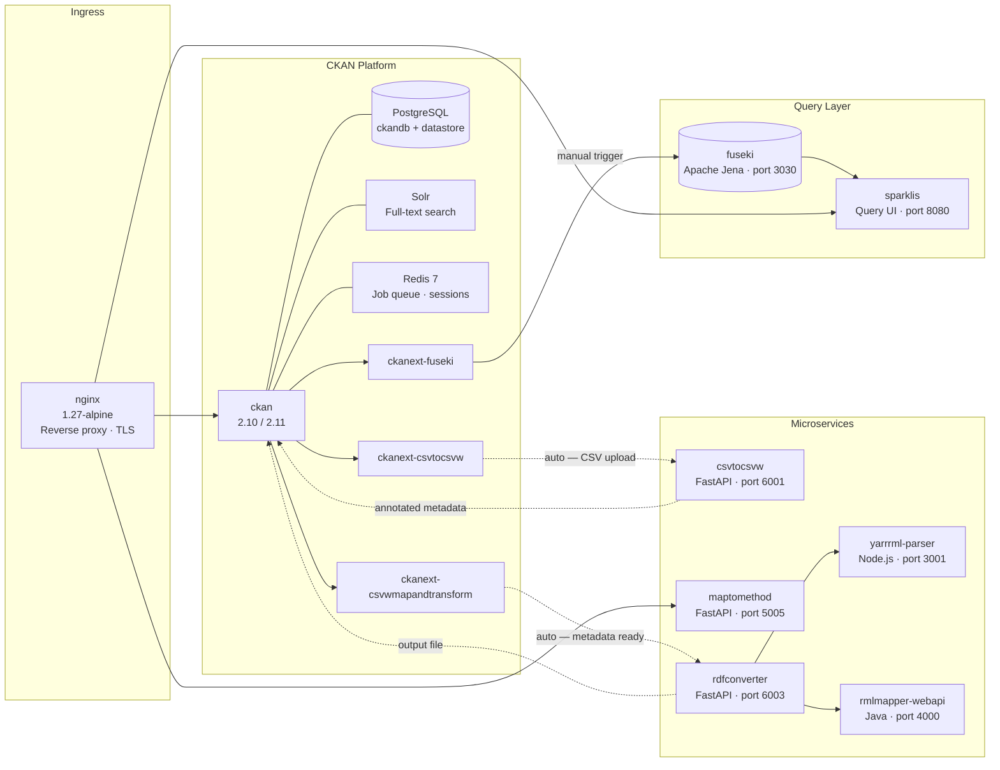

# Pipeline Overview

Full architecture of the Mat-O-Lab DataStack: all twelve services, their data flows, and exactly which steps are automated versus manual.

---

## Master System Diagram

The DataStack runs as a single `docker compose` stack. Four swim lanes group services by function: ingress, CKAN platform, microservices, and query layer. Solid arrows carry data; dashed arrows indicate CKAN automation; the Fuseki upload step is labelled **manual**.



All services share the internal bridge network `datastack_net`.  
Persistent volumes: `ckan_storage`, `pg_data`, `solr_data`, `jena_data`.

---

## Component Table

| Service | Docker Image | Role | Port / Access |
|---|---|---|---|
| `nginx` | `nginx:1.27-alpine` | Reverse proxy, TLS termination, internal routing | public (deployment hostname) |
| `ckan` | custom build (CKAN 2.10/2.11) | Data portal with all Mat-O-Lab extensions | public (deployment hostname) |
| `db` | custom PostgreSQL | `ckandb` + `datastore` databases | internal only |
| `solr` | `ckan/ckan-solr` | Full-text search index | internal only |
| `redis` | `redis:7-alpine` | RQ job queue + session cache | internal only |
| `fuseki` | `secoresearch/fuseki:4.9.0` | Graph database for linked data storage and querying (port 3030) | internal only |
| `csvtocsvw` | `ghcr.io/mat-o-lab/csvtocsvw` | Annotates CSV files with column metadata (FastAPI, port 6001) | [csvtocsvw.matolab.org](https://csvtocsvw.matolab.org) |
| `maptomethod` | `ghcr.io/mat-o-lab/maptomethod` | Web UI for authoring mapping files (FastAPI, port 5005) | [maptomethod.matolab.org](https://maptomethod.matolab.org) |
| `yarrrml-parser` | `ghcr.io/mat-o-lab/yarrrml-parser` | Mapping format converter (Node.js, port 3001) | internal only |
| `rmlmapper` | `ghcr.io/mat-o-lab/rmlmapper-webapi` | Data transformation engine (Java, port 4000) | internal only |
| `rdfconverter` | `ghcr.io/mat-o-lab/rdfconverter` | Orchestrates yarrrml-parser + rmlmapper (FastAPI, port 6003) | [rdfconverter.matolab.org](https://rdfconverter.matolab.org) |
| `sparklis` | `sferre/sparklis` | Faceted query UI for the graph database (port 8080) | public (deployment hostname) |

Version numbers are available at each service's `/info` endpoint.

---

## Two Transformation Paths

The pipeline converts uploaded data into a structured linked data output file (`.ttl`). The output format is called RDF — for what that means and why it exists, see [Semantic Foundation](semantic-foundation.md). From an operator's perspective, what matters is which services are involved and what triggers what.

### Path 1 — Single-stage mapping

**When to use:** CSV lab data, OMERO microscopy images, OpenBIS ELN entries, IDTA/AAS submodels — any source where one mapping file covers the translation in a single step.

```
Raw data file (CSV, JSON, XML)
  → Extractor service          Annotates data with column metadata and schema
  → MapToMethod               Mapping file applied (defines how fields are translated)
  → RDFConverter              Runs the mapping → produces a structured output file (.ttl)
  → Fuseki                    Loads the output for querying (manual trigger required)
```

**CKAN automation level:** Steps 1–3 (upload through output file creation) run automatically. Fuseki load requires a manual trigger.

### Path 2 — Two-stage mapping

**When to use:** Catena-X / SAMM JSON payloads where the source data already follows an intermediate schema. A single mapping file would not be enough — the data is first converted, then reshaped in a second pass.

```
JSON data (Catena-X / SAMM format)
  Stage 1 — Convert
    → RDFConverter + mapping file    JSON → intermediate output file (.ttl)
    → Fuseki                         Intermediate file loaded into graph database

  Stage 2 — Reshape
    → SPARQL CONSTRUCT query         Reshapes the intermediate data to the target schema
    (run manually against Fuseki)
    → Named graph                    Final output in target schema, stored in Fuseki
```

| Aspect | Stage 1 | Stage 2 |
|---|---|---|
| Input | Raw data file (JSON, CSV) | Intermediate file already loaded in Fuseki |
| Output | Intermediate output file | Final reshaped output file |
| Primary purpose | Data → linked data conversion | Schema → schema translation |
| Trigger | RDFConverter API | Manual query against Fuseki |
| Automation | Auto via ckanext-csvwmapandtransform | Manual |

For a worked example see [SAMM / Catena-X](advanced/samm-catena-x.md).

---

## Entry Points by Resource Type

| Resource type | Extractor | Mapping tool | Path |
|---|---|---|---|
| CSV lab data | [CSVToCSVW](../extractors/csvtocsvw.md) | MapToMethod | Path 1 — single-stage |
| OMERO microscopy | [OmeroExtractor](../extractors/omeroextractor.md) | MapToMethod | Path 1 — single-stage |
| OpenBIS ELN | [OpenBISmantic](../extractors/openbismantic.md) | MapToMethod | Path 1 — single-stage |
| SQL database | [Ontop](../extractors/ontop.md) | R2RML mapping | Path 1 — single-stage |
| SAMM / Catena-X JSON | — (direct input) | MapToMethod (JSONPath) | Path 2 — two-stage |
| IDTA / AAS submodel | — (direct input) | MapToMethod (JSONPath) | Path 1 — single-stage |

---

## Automation Boundary

Understanding what CKAN automates and what requires a human action is critical for deployment troubleshooting.

### What CKAN automates

All of the following happen automatically after a CSV (or `.asc`, `.tsv`, `.txt`) file is uploaded to a CKAN dataset — **provided `BACKGROUNDJOBS_API_TOKEN` is set**:

| Step | Extension | Service called |
|---|---|---|
| CSV → annotated metadata file | [ckanext-csvtocsvw](../components/ckanext-csvtocsvw.md) | [CSVToCSVW](../extractors/csvtocsvw.md) |
| Metadata → structured output file | [ckanext-csvtocsvw](../components/ckanext-csvtocsvw.md) | internal conversion |
| Mapping file selection from `mappings` group | [ckanext-csvwmapandtransform](../components/ckanext-csvwmapandtransform.md) | CKAN group API |
| Mapping execution → final output file | [ckanext-csvwmapandtransform](../components/ckanext-csvwmapandtransform.md) | [RDFConverter](../components/rdfconverter.md) |

### What is manual

| Step | Reason |
|---|---|
| Set `BACKGROUNDJOBS_API_TOKEN` after first boot | Token does not exist until CKAN creates it — see [Quickstart](../guides/quickstart.md) |
| Create the `mappings` CKAN group (exact case) | Required by ckanext-csvwmapandtransform; not created automatically |
| Author a mapping file in MapToMethod | Domain-specific knowledge required — see [Author a Mapping](../guides/author-a-mapping.md) |
| Load output file into Fuseki | Auto-sync hooks exist in ckanext-fuseki but are currently disabled; trigger via CKAN UI or API |
| Stage 2 schema translation (Path 2) | Must be run manually against Fuseki after Stage 1 output is loaded |

!!! warning "Most common setup failure"
    `BACKGROUNDJOBS_API_TOKEN` not set — all three background-job extensions run but their jobs never execute. No CSV annotation, no mapping execution, no output file is produced. See [Configuration](../reference/configuration.md) for the full `.env` variable list.

---

## Configuration Convention

Every `.env` variable prefixed `CKANINI__` is auto-translated into `ckan.ini` at container start:

- The `CKANINI__` prefix is stripped
- `__` (double underscore) → `.` (dot)
- Result is lowercased

**Example:** `CKANINI__CKANEXT__FUSEKI__URL` → `ckanext.fuseki.url`

See [Configuration Reference](../reference/configuration.md) for all critical variables.

---

## Where to Go Next

- **Deploy the stack:** [Quickstart](../guides/quickstart.md)
- **Understand the default CSV path step by step:** [Default Use Case](default-use-case.md)
- **See what resource types are supported:** [Capability Map](capability-map.md)
- **Author a mapping file:** [Author a Mapping](../guides/author-a-mapping.md)
- **Understand what linked data and RDF are:** [Semantic Foundation](semantic-foundation.md)
- **Component deep-dives:** [DataStack](../components/datastack.md) · [MapToMethod](../components/maptomethod.md) · [RDFConverter](../components/rdfconverter.md)
- **All configuration variables:** [Configuration](../reference/configuration.md)
