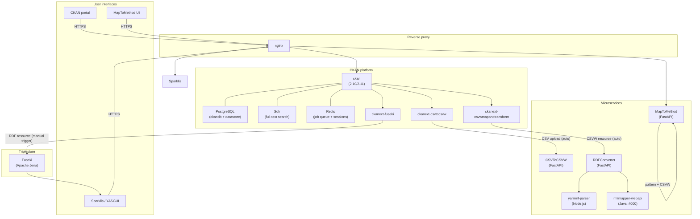

# Pipeline Overview

Full architecture of the Mat-O-Lab DataStack: services, data flows, and which steps are automated versus manual.

## Service Topology



*See the component table below for a text description of this topology.*

All services share the internal bridge network `datastack_net`.  
Persistent volumes: `ckan_storage`, `pg_data`, `solr_data`, `jena_data`.

---

## Component Table

| Service | Image | Role | Automated? |
|---|---|---|---|
| `nginx` | nginx:1.27-alpine | Reverse proxy / TLS termination | Yes |
| `ckan` | custom build | CKAN 2.10/2.11 data portal | Yes |
| `db` | custom PostgreSQL | `ckandb` + `datastore` databases | Yes |
| `solr` | ckan/ckan-solr | Full-text search index | Yes |
| `redis` | redis:7-alpine | RQ job queue + session cache | Yes |
| `fuseki` | secoresearch/fuseki:4.9.0 | Apache Jena Fuseki triple store | Manual trigger |
| `csvtocsvw` | ghcr.io/mat-o-lab/csvtocsvw | CSV → CSVW metadata (FastAPI) | Auto on upload |
| `maptomethod` | ghcr.io/mat-o-lab/maptomethod | YARRRML mapping editor (FastAPI) | Manual authoring |
| `yarrrml-parser` | ghcr.io/mat-o-lab/yarrrml-parser | YARRRML → RML conversion (Node.js) | Auto (via RDFConverter) |
| `rmlmapper` | ghcr.io/mat-o-lab/rmlmapper-webapi | RML execution engine (Java, port 4000) | Auto (via RDFConverter) |
| `rdfconverter` | ghcr.io/mat-o-lab/rdfconverter | Orchestrates yarrrml-parser + rmlmapper | Auto (triggered by ckanext-csvwmapandtransform) |
| `sparklis` | sferre/sparklis | User-friendly SPARQL query UI | On demand |

---

## Two Transformation Paths

### Path 1 — Direct YARRRML/RML

Used for CSV lab data (default use case) and IDTA/AAS submodels.

```
Raw data (CSV / AAS JSON)
  → CSVToCSVW / OmeroExtractor   (metadata annotation)
  → MapToMethod + OntosphereIO   (YARRRML mapping authoring)
  → RDFConverter                 (YARRRML + RML execution)
  → RDF knowledge graph          (loaded into Fuseki)
```

The YARRRML mapping file maps data fields directly to the target ontology (PMDco). One step from raw data to FAIR RDF.

### Path 2 — Two-Stage with SPARQL CONSTRUCT

Used for SAMM / Catena-X aspect model payloads where source and target ontologies differ structurally.

```
Flat JSON (Catena-X / SAMM payload)
  → RDFConverter + YARRRML mapping   Stage 1: JSON → SAMM-aligned intermediate RDF
  → Fuseki                           Intermediate graph loaded into triplestore
  → SPARQL CONSTRUCT query           Stage 2: SAMM RDF → PMDco or AutoMatCE
  → Named graph <pmdco>              Target-ontology knowledge graph
```

The CONSTRUCT query uses a `VALUES` table to parameterize unit conversions and ontology mappings for multiple properties at once. See [SAMM / Catena-X](advanced/samm-catena-x.md) for full details.

| Aspect | YARRRML/RML (Stage 1 or standalone) | SPARQL CONSTRUCT (Stage 2) |
|---|---|---|
| Input | Raw data (JSON, CSV, XML, RDF) | Existing RDF graph |
| Output | RDF knowledge graph | Reshaped / re-ontologized RDF |
| Primary purpose | Data → RDF lifting | Ontology → ontology translation |
| Trigger | RDFConverter API | SPARQL engine (Fuseki) |

---

## Entry Points by Resource Type

| Resource type | Extractor | Mapping tool | Transformation path |
|---|---|---|---|
| CSV lab data | [CSVToCSVW](../extractors/csvtocsvw.md) | MapToMethod + OntosphereIO | Path 1 — direct YARRRML/RML |
| OMERO microscopy | [OmeroExtractor](../extractors/omeroextractor.md) | MapToMethod + OME ontology | Path 1 — direct YARRRML/RML |
| OpenBIS ELN | [OpenBISmantic](../extractors/openbismantic.md) | YARRRML mapping | Path 1 — direct YARRRML/RML |
| SAMM / Catena-X JSON | — (direct input) | YARRRML (JSONPath) | Path 2 — two-stage with CONSTRUCT |
| IDTA / AAS submodel | — (direct input) | YARRRML (JSONPath) | Path 1 — direct YARRRML/RML |
| SQL database | [Ontop](../extractors/ontop.md) | R2RML mapping | Path 1 — direct (potential) |
