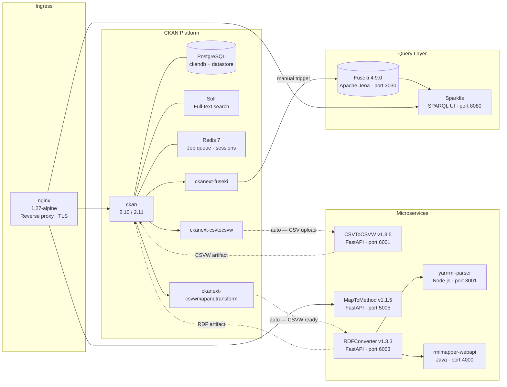

# Pipeline Overview

Full architecture of the Mat-O-Lab DataStack: all twelve services, their data flows, and exactly which steps are automated versus manual.

---

## Master System Diagram

The DataStack runs as a single `docker compose` stack. Four swim lanes group services by function: ingress, CKAN platform, microservices, and query layer. Solid arrows carry data; dashed arrows indicate CKAN automation; the Fuseki upload step is labelled **manual**.



All services share the internal bridge network `datastack_net`.  
Persistent volumes: `ckan_storage`, `pg_data`, `solr_data`, `jena_data`.

---

## Component Table

| Service | Docker Image | Role | Public URL |
|---|---|---|---|
| `nginx` | `nginx:1.27-alpine` | Reverse proxy, TLS termination, internal routing | deployment hostname |
| `ckan` | custom build (CKAN 2.10/2.11) | Data portal with all Mat-O-Lab extensions | deployment hostname |
| `db` | custom PostgreSQL | `ckandb` + `datastore` databases | internal only |
| `solr` | `ckan/ckan-solr` | Full-text search index | internal only |
| `redis` | `redis:7-alpine` | RQ job queue + session cache | internal only |
| `fuseki` | `secoresearch/fuseki:4.9.0` | Apache Jena Fuseki SPARQL triplestore (port 3030) | internal only |
| `csvtocsvw` | `ghcr.io/mat-o-lab/csvtocsvw` | CSV → CSVW metadata annotation (FastAPI, port 6001) — v1.3.5 | [csvtocsvw.matolab.org](https://csvtocsvw.matolab.org) |
| `maptomethod` | `ghcr.io/mat-o-lab/maptomethod` | YARRRML mapping authoring UI (FastAPI, port 5005) — v1.1.5 | [maptomethod.matolab.org](https://maptomethod.matolab.org) |
| `yarrrml-parser` | `ghcr.io/mat-o-lab/yarrrml-parser` | YARRRML → RML conversion (Node.js, port 3001) | internal only |
| `rmlmapper` | `ghcr.io/mat-o-lab/rmlmapper-webapi` | RML execution engine (Java, port 4000) | internal only |
| `rdfconverter` | `ghcr.io/mat-o-lab/rdfconverter` | Orchestrates yarrrml-parser + rmlmapper (FastAPI, port 6003) — v1.3.3 | [rdfconverter.matolab.org](https://rdfconverter.matolab.org) |
| `sparklis` | `sferre/sparklis` | User-friendly faceted SPARQL query UI (port 8080) | deployment hostname |

Version numbers sourced from the live `/info` endpoints (fetched 2026-09-24).

---

## Two Transformation Paths

The pipeline supports two strategies for lifting raw data into an RDF knowledge graph. Choose based on how structurally different the source and target ontologies are.

### Path 1 — Direct YARRRML / RML

**When to use:** CSV lab data, OMERO microscopy images, OpenBIS ELN entries, IDTA/AAS submodels — any source where a single YARRRML mapping can span source fields to target ontology terms directly.

```
Raw data (CSV, JSON, XML, RDF)
  → Extractor service            CSV → CSVW · OMERO → OME JSON-LD · openBIS → Schema.org JSON-LD
  → MapToMethod + OntosphereIO  YARRRML mapping authoring
  → RDFConverter                YARRRML → RML (yarrrml-parser) + RML execution (rmlmapper)
  → RDF knowledge graph         target-ontology aligned (e.g. PMDco)
  → Fuseki                      SPARQL endpoint (manual trigger)
```

The YARRRML file maps source data fields directly to target ontology classes and properties. One transformation hop from raw data to FAIR RDF.

**CKAN automation level:** Steps 1–3 (CSV upload through RDF artifact creation) run automatically. Fuseki upload requires a manual trigger.

### Path 2 — Two-Stage YARRRML + SPARQL CONSTRUCT

**When to use:** Catena-X / SAMM aspect model payloads where the source JSON follows a domain-specific intermediate ontology (SAMM) that must be re-ontologized to a target ontology (PMDco, AutoMatCE). A single YARRRML mapping would require mapping every property individually; a SPARQL CONSTRUCT query with a `VALUES` table handles this in bulk.

```
Flat JSON (Catena-X / SAMM payload)
  Stage 1 — Data lifting
    → RDFConverter + YARRRML mapping    JSON → SAMM-aligned intermediate RDF
    → Fuseki                            Intermediate named graph loaded

  Stage 2 — Ontology translation
    → SPARQL CONSTRUCT query            SAMM RDF → PMDco / AutoMatCE
    (parameterized with VALUES table for unit conversions and property mappings)
    → Named graph <pmdco>               Target-ontology knowledge graph
```

| Aspect | Stage 1 — YARRRML/RML | Stage 2 — SPARQL CONSTRUCT |
|---|---|---|
| Input | Raw data (JSON, CSV, XML) | Existing RDF graph in Fuseki |
| Output | RDF knowledge graph | Reshaped / re-ontologized RDF |
| Primary purpose | Data → RDF lifting | Ontology → ontology translation |
| Trigger | RDFConverter API | SPARQL engine (Fuseki) |
| Automation | Auto via ckanext-csvwmapandtransform | Manual CONSTRUCT execution |

For full details and an example CONSTRUCT query see [SAMM / Catena-X](advanced/samm-catena-x.md).

---

## Entry Points by Resource Type

| Resource type | Extractor | Mapping tool | Transformation path |
|---|---|---|---|
| CSV lab data | [CSVToCSVW](../extractors/csvtocsvw.md) | MapToMethod + OntosphereIO | Path 1 — direct YARRRML/RML |
| OMERO microscopy | [OmeroExtractor](../extractors/omeroextractor.md) | MapToMethod + OME ontology | Path 1 — direct YARRRML/RML |
| OpenBIS ELN | [OpenBISmantic](../extractors/openbismantic.md) | YARRRML mapping | Path 1 — direct YARRRML/RML |
| SQL database | [Ontop](../extractors/ontop.md) | R2RML mapping | Path 1 — direct YARRRML/RML |
| SAMM / Catena-X JSON | — (direct input) | YARRRML (JSONPath) | Path 2 — two-stage with CONSTRUCT |
| IDTA / AAS submodel | — (direct input) | YARRRML (JSONPath) | Path 1 — direct YARRRML/RML |

---

## Automation Boundary

Understanding what CKAN automates and what requires a human action is critical for deployment troubleshooting.

### What CKAN automates

All of the following happen automatically after a CSV (or `.asc`, `.tsv`, `.txt`) file is uploaded to a CKAN dataset — **provided `BACKGROUNDJOBS_API_TOKEN` is set**:

| Step | Extension | Service called |
|---|---|---|
| CSV → CSVW JSON-LD annotation | [ckanext-csvtocsvw](../components/ckanext-csvtocsvw.md) | [CSVToCSVW](../extractors/csvtocsvw.md) |
| CSVW → Turtle RDF serialization | [ckanext-csvtocsvw](../components/ckanext-csvtocsvw.md) | internal conversion |
| Mapping selection from `mappings` group | [ckanext-csvwmapandtransform](../components/ckanext-csvwmapandtransform.md) | CKAN group API |
| YARRRML/RML execution → joined Turtle | [ckanext-csvwmapandtransform](../components/ckanext-csvwmapandtransform.md) | [RDFConverter](../components/rdfconverter.md) |

### What is manual

| Step | Reason |
|---|---|
| Set `BACKGROUNDJOBS_API_TOKEN` after first boot | Token does not exist until CKAN creates it — see [Quickstart](../guides/quickstart.md) |
| Create the `mappings` CKAN group (exact case) | Required by ckanext-csvwmapandtransform; not created automatically |
| Author a YARRRML mapping in MapToMethod | Domain-specific knowledge required — see [Author a Mapping](../guides/author-a-mapping.md) |
| Upload joined Turtle to Fuseki | Auto-sync hooks exist in ckanext-fuseki but are currently disabled; trigger via CKAN UI or API |
| Stage 2 SPARQL CONSTRUCT (Path 2) | Must be run manually against Fuseki after Stage 1 RDF is loaded |

!!! warning "Most common setup failure"
    `BACKGROUNDJOBS_API_TOKEN` not set — all three background-job extensions run but their jobs never execute. No CSV annotation, no RDF conversion, no mapping selection happens. See [Configuration](../reference/configuration.md) for the full `.env` variable list.

---

## Configuration Convention

Every `.env` variable prefixed `CKANINI__` is auto-translated into `ckan.ini` at container start:

- The `CKANINI__` prefix is stripped
- `__` (double underscore) → `.` (dot)
- Result is lowercased

**Example:** `CKANINI__CKANEXT__FUSEKI__URL` → `ckanext.fuseki.url`

See [Configuration Reference](../reference/configuration.md) for all critical variables.

---

## Where to Go Next

- **Deploy the stack:** [Quickstart](../guides/quickstart.md)
- **Understand the default CSV path step by step:** [Default Use Case](default-use-case.md)
- **See what resource types are supported:** [Capability Map](capability-map.md)
- **Author a mapping:** [Author a Mapping](../guides/author-a-mapping.md)
- **Component deep-dives:** [DataStack](../components/datastack.md) · [MapToMethod](../components/maptomethod.md) · [RDFConverter](../components/rdfconverter.md)
- **All configuration variables:** [Configuration](../reference/configuration.md)
