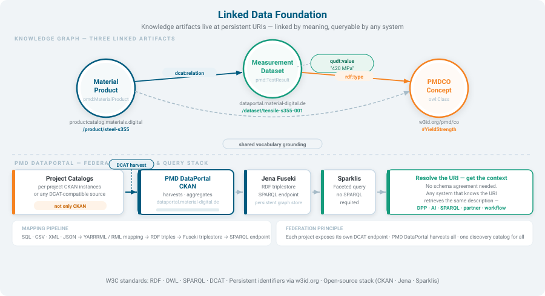
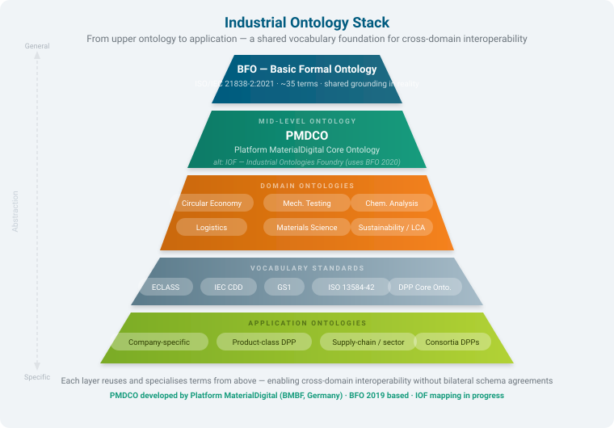
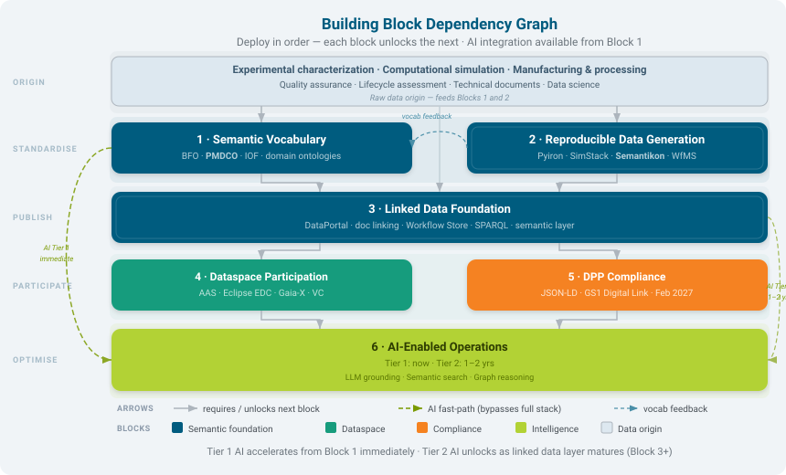

# Semantic Foundation

When research data leaves a laboratory — a tensile test result, a microscopy measurement, a synthesis record — it typically travels as a spreadsheet or a proprietary file. Another team, another institution, or a future researcher faces a simple problem: **they cannot tell what the numbers mean** without reading a README, emailing an author, or guessing from column headers.

This page explains why DataStack solves that problem using linked data and shared vocabularies, and what that means for your data in practice.

---

## The Core Idea: Resources Get Permanent Addresses

Every meaningful thing — a measurement, a sample, a specimen, a test method — can be given a **persistent, globally unique address** (called a Uniform Resource Identifier, or URI). Think of a URI as a DOI for a concept rather than a document: a permanent label that works anywhere, identifies exactly one thing, and carries its meaning with it.

When two datasets about steel samples use the same URI for "tensile strength", any system — any institution, any software tool — can recognise that they describe the same property. The data becomes self-describing.

This is linked data in one sentence: **give things permanent addresses, and the meaning travels with the data.**

The diagram shows how DataStack implements this in practice. Data uploaded to the CKAN portal is annotated, transformed into linked data, and stored in a query database (Apache Jena Fuseki). From there it can be browsed interactively through Sparklis or queried directly — by humans, by software, or by other data systems that speak the same shared vocabulary.

---

## Shared Vocabularies: Ontologies

A URI identifies *what* a thing is, but doesn't define *what that means*. That definition lives in an **ontology** — a structured dictionary that specifies concepts and their relationships. Think of it as a shared glossary that every system in a community agrees to use.

DataStack uses a layered set of ontologies designed for industrial and scientific data:

| Layer | Name | What it covers |
|-------|------|---------------|
| Top | **BFO** (Basic Formal Ontology) | Universal concepts: objects, processes, time, qualities |
| Mid | **PMDCO** (PMD Core Ontology) | Materials science: specimens, tests, processes, measurements |
| Domain | e.g. CHAMEO, EMMO modules | Specific domains: microscopy, electrochemistry, mechanical testing |
| Application | Local extensions | Institution- or dataset-specific terms |

You do not need to understand these layers to use DataStack. What matters is the outcome: when your tensile test result for steel S355 is published through DataStack, it uses the same vocabulary as every other materials science dataset in the network — making your data findable and comparable by anyone using the same standard.

---

## Where DataStack Fits: Block 2 of the Semantic Interoperability Building Blocks

The semantic interoperability effort in materials science is organised into building blocks — components that together enable data to be found, understood, and reused across institutions and systems.

DataStack implements **Block 2: the semantic data foundation**. It provides the platform — the portal, the transformation pipeline, and the query interface — that puts shared vocabularies into production. It sits between the raw data your lab produces (Block 1) and the discovery and query services that use it (Block 3 and beyond).

---

## What "FAIR" Means Here

You may have encountered FAIR data principles (Findable, Accessible, Interoperable, Reusable). DataStack makes each one concrete:

| Principle | What DataStack does |
|-----------|---------------------|
| **Findable** | Every dataset is published in CKAN with searchable metadata, following the DCAT standard for data catalogues |
| **Accessible** | Data is available through a SPARQL query interface — a standard protocol any software can use to retrieve it |
| **Interoperable** | Data is annotated using PMDCO and domain ontologies, so any system using the same vocabulary can interpret it without human translation |
| **Reusable** | Datasets carry persistent URIs and open ontology links — meaning the data remains interpretable years later, even without the original author |

At [dataportal.material-digital.de](https://dataportal.material-digital.de/), you can see these principles applied to real materials science datasets — tensile tests, microstructure measurements, and synthesis records — shared across institutions using this infrastructure.

---

## Where to Go Next

!!! tip "Choose your path"
    === "I want to deploy DataStack"
        You are an operator setting up the infrastructure.
        → [Quickstart guide](../guides/quickstart.md) — Docker Compose commands, environment variables, first boot.

    === "I want to connect my data"
        You are a data engineer writing mappings or integrating APIs.
        → [Author a Mapping](../guides/author-a-mapping.md) — how to describe your CSV columns using shared vocabulary.

    === "I want to explore existing data"
        You are a domain scientist who wants to use the pipeline outputs.
        → [Standalone APIs](../guides/standalone-apis.md) — how to upload data and retrieve FAIR outputs without writing code.
